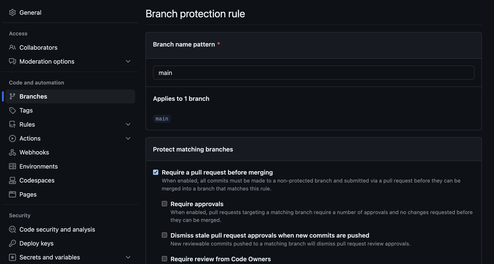
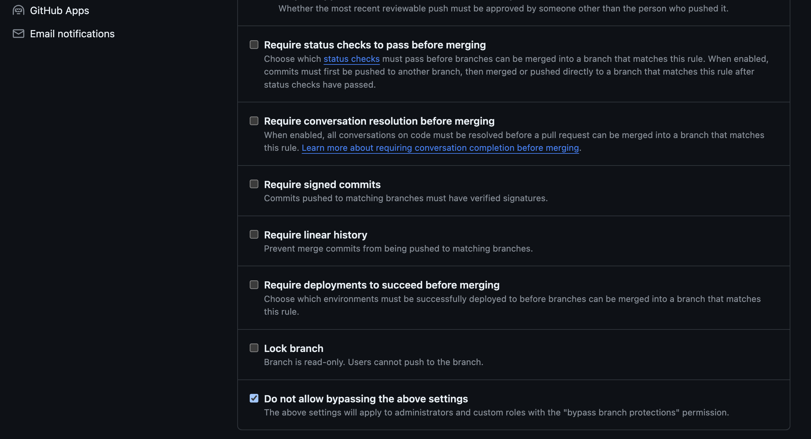
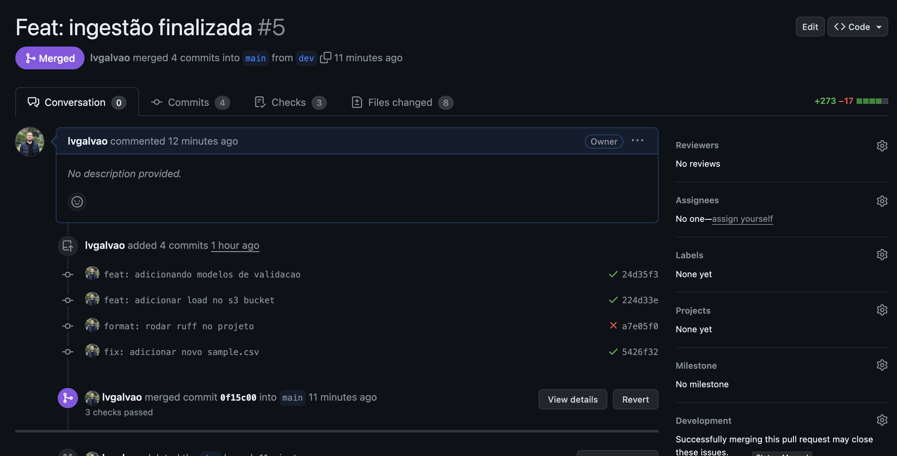
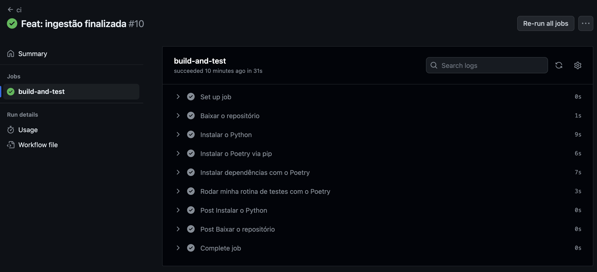

# Projeto DuckDB Evidence Insights

## Descrição

O projeto DuckDB Evidence Insights é uma solução de ETL (Extração, Transformação e Carga) de dados que visa coletar, processar e armazenar dados relacionados a downloads de pacotes do Python do repositório PyPI. 

O projeto utiliza o DuckDB como o mecanismo de armazenamento de dados e fornece uma infraestrutura para realizar análises e consultas sobre esses dados. O vídeo tutorial pode ser [visto aqui](https://www.youtube.com/watch?v=3pLKTmdWDXk&t=1326s)

## Propósito

O propósito principal do projeto DuckDB Evidence Insights é permitir que os usuários obtenham insights valiosos a partir dos dados de downloads de pacotes Python. Isso pode ser útil para monitorar tendências, identificar problemas de segurança, otimizar o uso de recursos e tomar decisões informadas em relação à gestão de pacotes.

## Funcionalidades

* Extração de dados do BIGQUERY.
* Transformação dos dados para um formato adequado.
* Armazenamento dos dados localmente usando o DUCKDB.
* Exportação de dados para o Amazon S3.
* Transformação e cálculo dos KPIs usando o DBT-CORE [TODO]
* Visualização dos dados utilizando o EVIDENCE [TODO]

## Testes

### Validação do Schema

Uma parte crítica do projeto é a validação do schema dos dados. Isso é feito para garantir que os dados extraídos e processados estejam de acordo com o schema definido. Se os dados não estiverem em conformidade, ocorrerá uma validação de dados e serão gerados erros para identificar as discrepâncias. A validação do schema é realizada para manter a integridade dos dados e garantir a qualidade das análises posteriores.

### Testes Unitários

Uma parte crucial do projeto DuckDB Evidence Insights é garantir que o esquema de dados tenha sido criado de forma precisa e eficaz. Para atender a esse objetivo, foram implementados testes unitários que verificam se o esquema está de acordo com as expectativas.

Existem dois testes específicos que são executados como parte da validação do esquema:

1. **Teste de Validação do Schema**: Este teste percorre um dataset de exemplo que contém dados corretos e verifica se o esquema de dados criado corresponde ao esperado. Ele valida cada coluna e estrutura de dados em relação ao modelo Pydantic utilizado para representar os dados.
    
2. **Teste de Dados Inválidos**: Além de verificar os dados corretos, também é importante garantir que o sistema lide corretamente com dados inválidos. Este teste introduz intencionalmente dados inválidos no dataset e verifica se o sistema os detecta e os trata adequadamente. Isso inclui verificar se os erros são registrados e se a integridade do esquema é mantida.
    
Esses testes unitários são executados durante o processo de `pull request` acomplado em uma rotina de `CI/CD usando o github actions`. Eles desempenham um papel fundamental na garantia da qualidade dos dados e na integridade do esquema, ajudando a evitar problemas de dados incorretos ou corrompidos. Para garantir que todo o processo siga da forma correta, adicionalmente foi inserido politicas de bloqueio da main, evitando que o push seja feito sem passar pela rotina de CI/CD.

Criando uma `branch rule`


Configurando para adminstrador não ter privilégio


Processo de PR


CI/CD em ação


## Uso do Projeto

### 1) Baixar o repo

```bash
git clone git@github.com:lvgalvao/Duckdb-dbt-evidence-insights.git
cd Duckdb-dbt-evidence-insights
```

### 2) Configurar versão do Python

```bash
pyenv local 3.11.5
```

### 3) Configurar ambiente virtual
```bash
poetry init
poetry env use 3.11.5
poetry shell
poety install
```

### 4) Realizar os testes

```bash
task tests
```

### 5) Configurando GCP e AWS

Necessário criar um arquivo `.env` com as variáveis destacadas no `exemplo.env`

```bash
TABLE_NAME=pypi_file_downloads
S3_PATH=s3://seu-s3-path
AWS_PROFILE=default
AWS_S3_REGION=us-west-1
AWS_ACCESS_KEY=sua-senha
AWS_SECREAT_ACCESS_KEY=sua-screat-access
GCP_PROJECT=duckdb-dbt-evidence-insights
START_DATE=2023-04-01
END_DATE=2023-04-03
PYPI_PROJECT=duckdb
GOOGLE_APPLICATION_CREDENTIALS=demo-pypi.json
motherduck_token=123123
TIMESTAMP_COLUMN=timestamp
DESTINATION=s3
```

Além de configurar também o seu arquivo `demo-pypi.json` utilizando o `demo-pypi-exemplo.json`
Com sua `Google Application Credentials`

### 5) Rodar a Pipeline
```bash
task run
```
